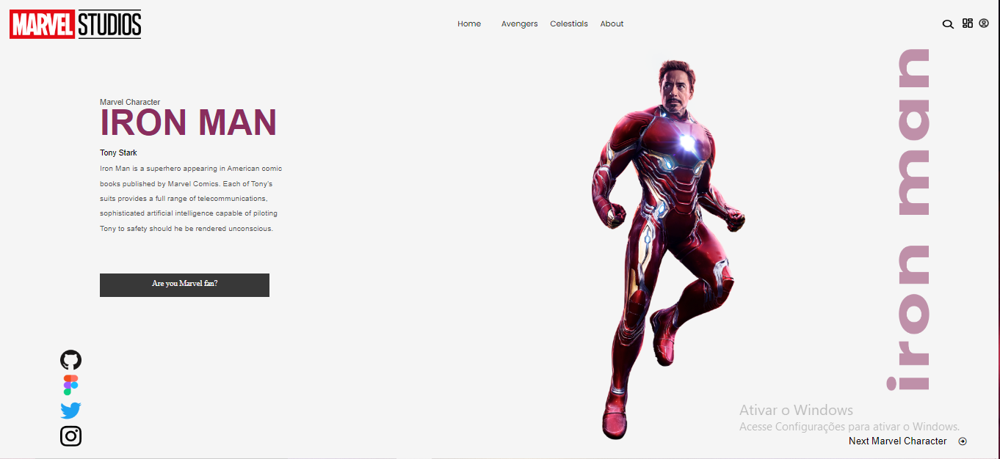

# site-homem-de-ferro

[Clique aqui](https://ratinho253.github.io/site-homem-de-ferro/) para acessar o site

---
## Sobre
Site é uma pagina para atividade do curso.
O objetivo deste projeto é colocar em prática os conhecimentos, sobre desenvolvimento de sites, adquiridos no curso do SENAI Jandira 

---
### tecnologias utilizadas
- HTML5
- CSS3
- Responsividade

---
### Autor 
- [João Victor da Silva](https://github.com/Ratinho253) 
